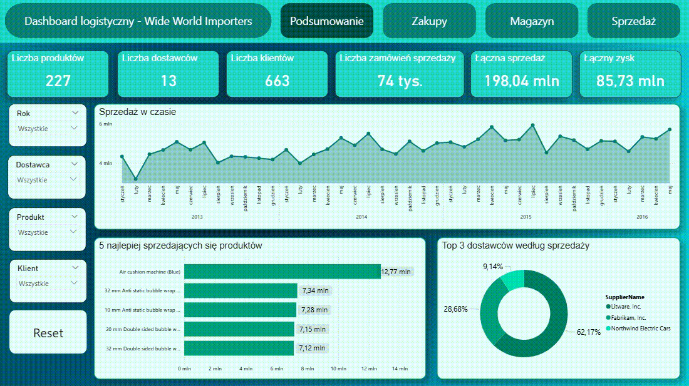
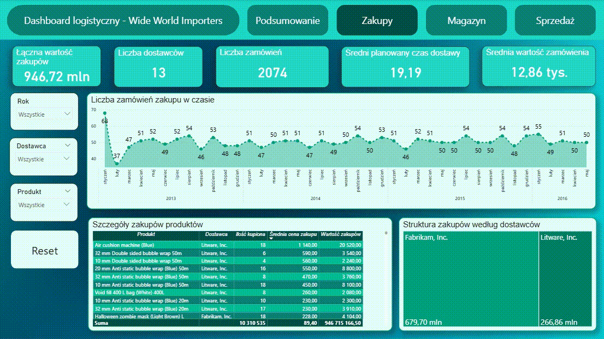
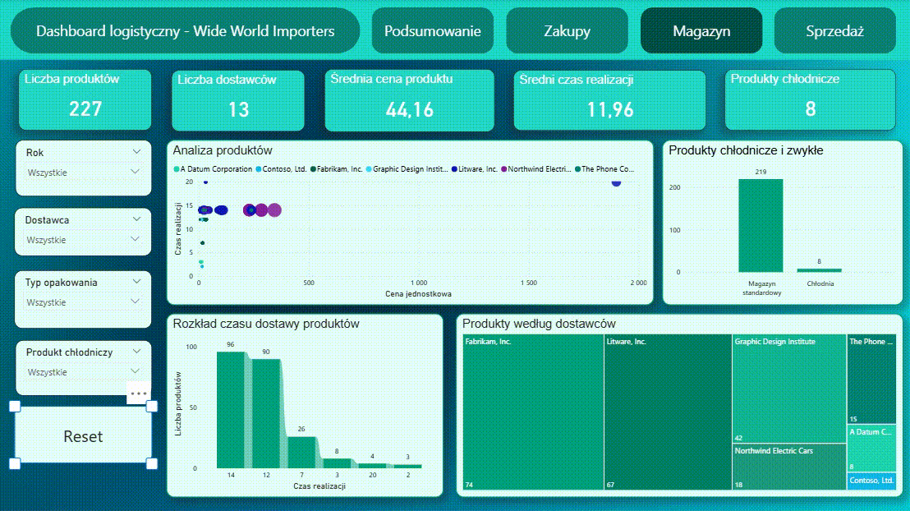
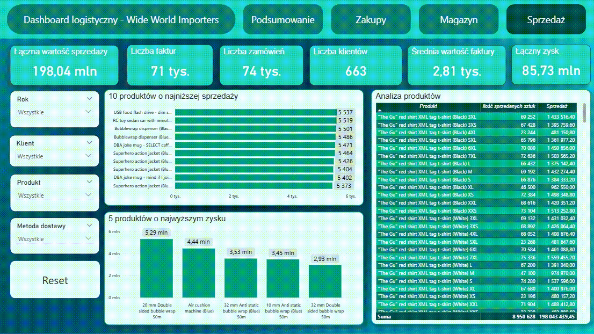

## Wide-World-Importers-Analysis - SQL & Power BI Dashboard

### Opis
Projekt przedstawia kompleksowe rozwiązanie klasy Business Intelligence, oparte na przykładowej bazie danych Wide World Importers dostarczanej wraz z systemem Microsoft SQL Server.

Głównym celem projektu była analiza procesów biznesowych związanych z zakupami, gospodarką magazynową i sprzedażą, a następnie wizualizacja wyników w postaci interaktywnego pulpitu nawigacyjnego 
w narzędziu Power BI. Projekt ukazuje pełny cykl od eksploracji relacyjnej bazy danych i tworzenia zapytań SQL, aż po projektowanie interaktywnego raportu analitycznego.

### Cele projektu
Projekt koncentruje się na kilku kluczowych celach:
- analizie procesów zakupowych,
- monitorowaniu operacji magazynowych,
- ocenie wyników sprzedaży,
- identyfikacji najbardziej dochodowych produktów,
- analizie dostawców i klientów,
- tworzeniu interaktywnych raportów wspierających podejmowanie decyzji biznesowych.

Analizę przeprowadzono w oparciu o trzy główne moduły biznesowe:
- Zakupy
- Magazyn
- Sprzedaż

Szczegółowa dokumentacja wykorzystująca zapytania SQL została opracowana w pliku PDF pt.["WideWorldImporters_SQL.pdf"](https://github.com/natalia-maler/Wide-World-Importers-Analysis/blob/main/WideWorldImporters_SQL.pdf), zawierającym opis struktury bazy danych, analizowanych modułów oraz wszystkich wykonanych zapytań SQL wraz z ich interpretacją.

### Dashboard Power BI
Celem opracowanego dashboardu w Power BI jest przedstawienie kompleksowej analizy działalności przedsiębiorstwa na podstawie danych z bazy Wide World Importers.
Dashboard umożliwia monitorowanie procesów związanych z zakupami, magazynowaniem oraz sprzedażą produktów, dostarczając użytkownikowi przejrzystych informacji wspierających podejmowanie decyzji biznesowych.

Raport składa się z czterech stron analitycznych.
- Podsumowanie - strona prezentuje najważniejsze informacje dotyczące działalności przedsiębiorstwa w jednym miejscu.

Najważniejsze informacje o działalności firmy:
- Liczba produktów oferowanych przez przedsiębiorstwo,
- Liczba dostawców współpracujących z firmą,
- Liczba klientów,
- Liczba zrealizowanych zamówień sprzedaży,
- Łączna wartość sprzedaży,
- Łączny wygenerowany zysk.

- Zakupy - sekcja przedstawia analizę procesu zaopatrzenia przedsiębiorstwa. Umożliwia ocenę współpracy z dostawcami, analizę kosztów zakupu oraz monitorowanie aktywności zakupowej. 

- Magazyn - strona została przygotowana w celu analizy produktów znajdujących się w ofercie przedsiębiorstwa oraz oceny parametrów logistycznych związanych z ich magazynowaniem i dostawą.

- Sprzedaż - sekcja umożliwia szczegółową analizę wyników sprzedażowych przedsiębiorstwa oraz identyfikację produktów generujących największe i najmniejsze wyniki.

Szczegółowy opis wizualizacji oraz interpretacja wyników zostały przedstawione w raporcie PDF ["Dashboard Power BI - baza WWI"](https://github.com/natalia-maler/Wide-World-Importers-Analysis/blob/main/Dashboard%20Power%20BI%20-%20baza%20WWI.pdf)

Projekt ten prezentuje pełny proces Business Intelligence od danych przechowywanych w relacyjnej bazie danych SQL, przez przetwarzanie analityczne, aż po stworzenie interaktywnego pulpitu nawigacyjnego w usłudze Power BI.

